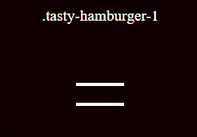

# Tasty Hamburger

IN PROGRESS

Check this big and yummy hamburger from Tasty Hamburger. It's delicious!

## What is Tasty Hamburger?

Tasty Hamburger is a collection of best hamburgers. You can simply put it in your project or site!

## How it works?

1. First clone or download this repository.
2. Add css/tasty-hamburger.min.css to your <head>.
`<link rel="stylesheet" href="css/tasty-hamburger.min.css">`
3. Add js/tasty-hamburger.min.js before </body>
``
4. Create div with `.tasty-hamburger-1` or `.tasty-hamburger-2` or `.tasty-hamburger-...` class.
5. You're ready to go!

You can use data attributes to control your menu when toggling Tasty Hamburger.
You may add something like `data-toggle-id="menu"` and `data-toggle-add-class="menu-vertical"` to hamburger div. When you click Tasty Hamburger to element #menu will be added class menu-vertical, if you click again - class will be deleted. You can do it in reverse too! Like: `data-reverse-toggle-id="menu"` and `data-reverse-toggle-add-class="menu-vertical"`. You can use *-toggle-* and *-reverse-toggle-* together to create something great!

### Examples

You can find all examples in `examle.html` file.

### Available Speeds

In Tasty Hamburger you can use three types of speed - slow, normal and fast.

#### Normal animation

For normal speed you don't need to add any class:

`.tasty-hamburger-1`

